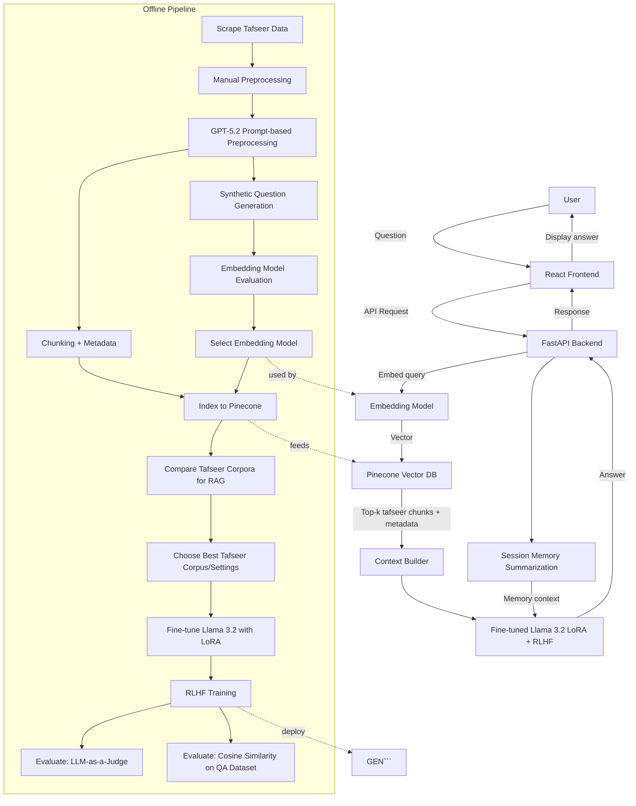
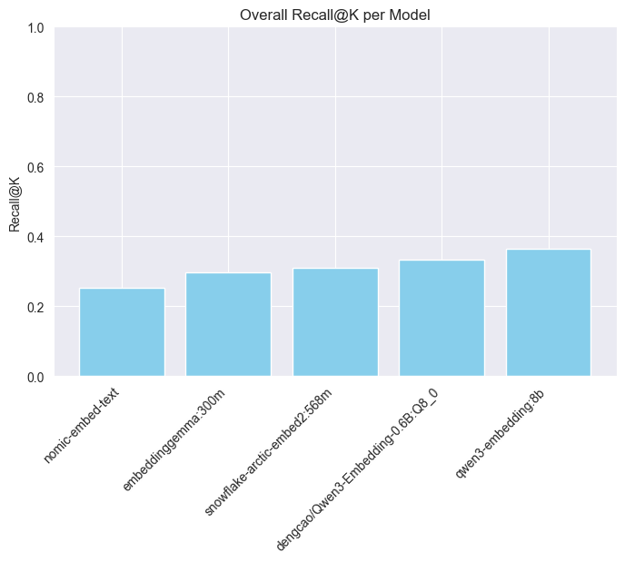
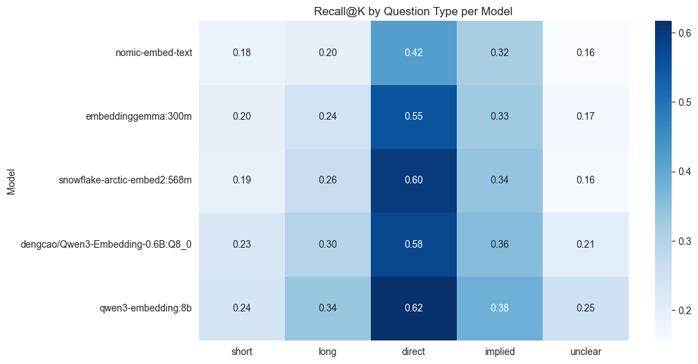
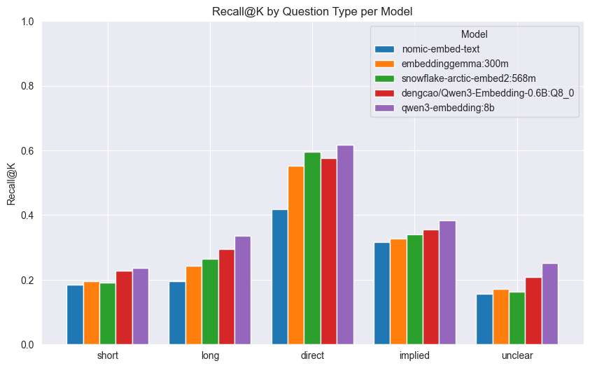
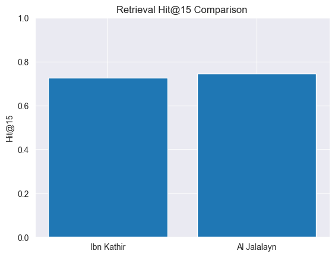
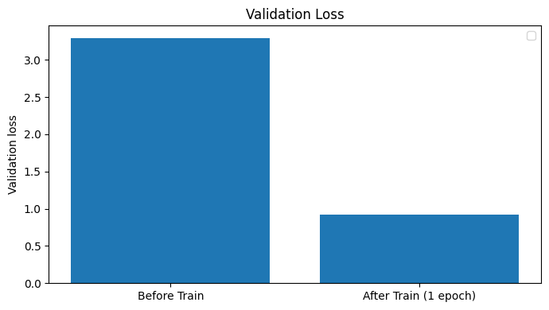
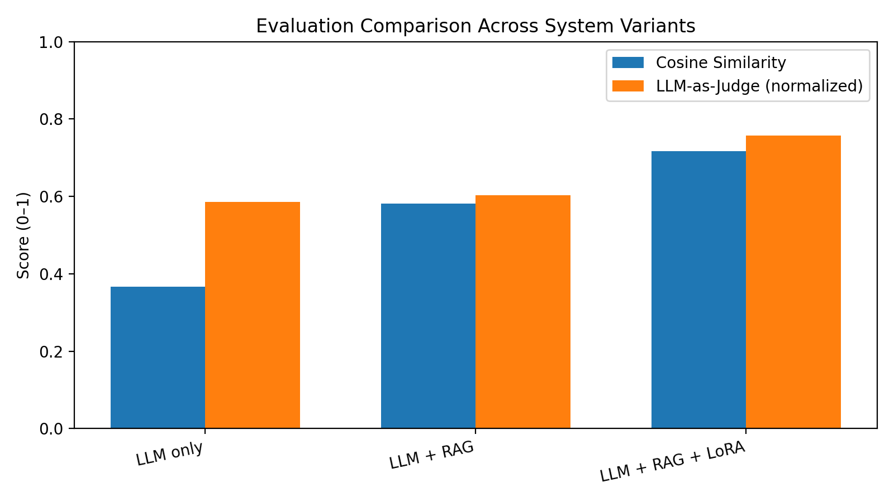

# Quran QA Chatbot (RAG + Fine-Tuned LLM)

A Quran-focused question-answering chatbot powered by **Retrieval-Augmented Generation (RAG)** and a **fine-tuned LLM**.  
The system answers questions by grounding responses in two major tafseer sources:

- **Tafseer Al-Jalalayn**
- **Tafseer Ibn Kathir**

Instead of relying only on the model’s internal knowledge, the chatbot retrieves the most relevant tafseer passages for each question, then generates an answer conditioned on that retrieved context to reduce hallucinations and improve faithfulness.

> ⚠️ Disclaimer: This project is intended for educational and informational use. For religious rulings or sensitive matters, consult qualified scholars.

---

## Table of Contents
- [Project Overview](#project-overview)
- [High-Level Pipeline](#high-level-pipeline)
- [Project Roadmap](#project-roadmap)
- [Tech Stack](#tech-stack)
- [1. Data Collection (Scraping)](#1-data-collection-scraping)
- [2. Preprocessing (Manual + GPT-Assisted)](#2-preprocessing-manual--gpt-assisted)
- [3. Embedding Model Benchmarking (Accuracy vs Latency)](#3-embedding-model-benchmarking-accuracy-vs-latency)
- [4. RAG Indexing & Retrieval (Pinecone)](#4-rag-indexing--retrieval-pinecone)
- [5. Tafseer Corpus Selection (Ibn Kathir vs Al-Jalalayn)](#5-tafseer-corpus-selection-ibn-kathir-vs-al-jalalayn)
- [6. Model Training (LoRA Fine-Tuning with Retrieval-Grounded Data)](#6-model-training-lora-fine-tuning-with-retrieval-grounded-data)
- [7. Evaluation (Cosine Similarity + LLM-as-Judge)](#7-evaluation-cosine-similarity--llm-as-judge)
- [8. Deployment (FastAPI + React)](#8-deployment-fastapi--react)

---
## Project Overview

- Scrapes and builds structured corpora for two tafseer sources
- Preprocesses, cleans, and chunks tafseer content using **manual preprocessing** + **Prompt-Based preprocessing**
- Benchmarks multiple embedding models using synthetic QA to choose the best accuracy/performance tradeoff
- Builds a RAG pipeline using **Pinecone** as the vector database
- Compares both tafseer corpora to determine which produces better RAG behavior
- Fine-tunes **Llama 3.2** with **LoRA** for Quran QA
- Improves alignment via **RLHF**
- Evaluates answer quality using:
  - **LLM-as-a-Judge**
  - **Cosine similarity** over a QA dataset
- Adds chat-session memory via summarization
- Deploys the full system using **FastAPI** (backend) + **React** (frontend)

---

## High-Level Pipeline

1. **User question**
2. **Embedding + retrieval** from tafseer chunks (Pinecone)
3. **Context assembly** (top-k passages + metadata)
4. **Answer generation** (fine-tuned Llama 3.2)
5. **Session memory update** (summarized state for continuity)

---

## Project Roadmap



---

# Tech Stack

### LLMs
- **Llama 3.2 (Instruct)** — main QA model (**LoRA fine-tuning + RLHF**)
- **Llama 3.1** — **synthetic question generation** + **LLM-as-a-Judge** evaluation (via Ollama)
- **GPT (GPT-5.2)** — prompt-based preprocessing (alongside manual preprocessing)

### RAG & Retrieval
- **LangChain** — RAG orchestration (retrieve → build context → generate), hybrid retriever integration
- **Pinecone** — production vector database for tafseer retrieval (RAG)
- **BM25** — sparse retrieval component for hybrid search (BM25 + dense)

### Embeddings & Vector Stores
- Multiple embedding models benchmarked for accuracy/latency tradeoff
- **PostgreSQL + pgvector** — used as the vector database during embedding-model experiments (to avoid Pinecone quota)
- **Ollama embeddings** — local embedding generation during experiments and evaluation

### Training & Alignment
- **LoRA / QLoRA** — parameter-efficient fine-tuning
- **RLHF** — alignment training stage (post-SFT)

### Evaluation
- **Cosine similarity** — automatic semantic similarity vs reference answers
- **LLM-as-a-Judge** — rubric-based grading using a judge model

### Memory
- **Session summarization** — chat memory via summarized conversation state

### Backend & Frontend
- **FastAPI** — backend API (retrieval + generation + memory + evaluation endpoints)
- **React** — frontend chatbot UI

### Tooling & Infrastructure
- **Ollama** — local model serving (generation, embeddings, judge, synthetic data)
- **Docker** — containerization for reproducible development & deployment

---


# 1. Data Collection (Scraping)

This stage builds the **raw tafseer corpora** used throughout the project (preprocessing → chunking → embedding evaluation → RAG indexing).  
Scraping is done at the **ayah level** for two sources:

- **Tafseer Al-Jalalayn** (altafsir.com)
- **Tafseer Ibn Kathir (English tafsir)** (quran.com)

### Notebook Used
- `tafseer_scraping.ipynb`

---

## What the Notebook Does

### A) Scrape Tafseer Al-Jalalayn (altafsir.com)
For each *(surah, ayah)* pair, the notebook visits a URL in this format:

`https://www.altafsir.com/Tafasir.asp?tMadhNo=0&tTafsirNo=74&tSoraNo={surah}&tAyahNo={ayah}&tDisplay=yes&UserProfile=0&LanguageId=2`

It extracts tafseer text using Selenium and stores results as structured rows.

**Output**
- `tafseer_scraped_jalayeen.csv`  
  Contains:
  - `Surah Number`
  - `Ayah Number`
  - `Text` (tafseer content)

---

### B) Scrape Tafseer Ibn Kathir (quran.com)
For each *(surah, ayah)* pair, the notebook visits:

`https://quran.com/{surah}:{ayah}/tafsirs/en-tafisr-ibn-kathir`

It waits for the tafseer content to load (dynamic page), extracts the text, and saves one file per ayah.

**Outputs**
- `ayat/` (directory)
  - `{surah}_{ayah}.txt` (JSON content) containing:
    - `Surah Number`
    - `Ayah Number`
    - `Text`

Then it merges all per-ayah files into a single dataset.

- `tafseer_scraped_ebnkathir.csv`  
  A merged and sorted CSV version of Ibn Kathir:
  - sorted by `Surah Number`, `Ayah Number`

---

## Inputs

- `Datasets/quran_surahs.csv`  
  Used to iterate over:
  - `Surah Number`
  - `Number of Ayat`

---

## Notes

- Used **Selenium** with **headless Chrome** for faster rendering
- Used explicit waiting for Quran.com content (dynamic rendering)
- Included a small sleep delay to reduce request rate during scraping


---

# 2. Preprocessing (Manual + GPT-Assisted)

This stage transforms the scraped tafseer text into **clean, high-signal, embedding-friendly passages** optimized for downstream **RAG retrieval**.

It includes two parts:

1. **Manual preprocessing** (cleaning/organizing the raw tafseer, preparing ranges/segments)
2. **GPT-assisted prompt preprocessing** to distill tafseer into concise, semantically dense explanations

Instead of using the GPT API, GPT-assisted preprocessing was done through **ChatGPT web UI automation** to reduce cost (ChatGPT Pro). The notebook automates:
- sending a **system prompt** + **user prompt**
- copying the generated response
- saving it to disk for later merging

---

### Notebook Used
- `tafseer_preprocessing.ipynb`

---

## What the Notebook Does

### A) Prompt Design / Prompt Iteration
The notebook contains multiple prompt trials and then a selected “final prompt” optimized for:
- retrieval accuracy (high signal-to-noise)
- concise cause–effect phrasing
- preserving Ibn Kathir’s meaning
- standardizing names (e.g., Joseph, Jacob, Moses)
- avoiding rhetorical/meta commentary

This prompt is used as the **System Prompt**, and each tafseer segment is wrapped into a structured **User Prompt** including ayah metadata.

---

### B) GPT-Assisted Preprocessing via ChatGPT UI Automation
To avoid GPT API costs, the notebook uses **GUI automation** (mouse/keyboard + clipboard copy/paste) to interact with ChatGPT in the browser.

The flow is:
1. Start a new chat
2. Paste the system prompt
3. Paste the user prompt containing the tafseer segment + metadata
4. Wait for the response
5. Select the response and copy it
6. Save it as a `.txt` file per ayah range

**Intermediate Output**
- `tafaseer/`
  - Files saved as: `{surah}_{ayahStart}-{ayahEnd}.txt`
  - Each file contains the GPT-distilled tafseer paragraph

> Note: The notebook uses fixed screen coordinates for clicks/selection, so it assumes a stable window layout.

---

### C) Merge + Normalize Outputs
After generating multiple `.txt` files, the notebook:
- loads them into a DataFrame
- sorts them by `surah_no` and `ayah_start`
- applies English text normalization (unicode normalization, punctuation normalization, whitespace cleanup)
- exports the final processed dataset

**Final Output**
- `tafseer_ebnalkatheer_final.csv`

---

## Inputs

- `tafsir_ibn_kathir_final.csv`  
  The baseline/raw Ibn Kathir dataset used as the source text for preprocessing.

- `tafaseer/` (generated during runs)  
  The notebook later reads the `.txt` outputs from here to build the final CSV.

---

## Outputs

- `tafaseer/` (directory of GPT-distilled segments)
- `tafseer_ebnalkatheer_final.csv` (final cleaned dataset used downstream for embedding + indexing)

---

# 3. Embedding Model Benchmarking (Accuracy vs Latency)

This stage benchmarks multiple **embedding models** to choose the best **retrieval accuracy / inference-time tradeoff** for the final RAG system.

During experimentation, I used **PostgreSQL + pgvector** (via SQL) as the vector store to avoid consuming **Pinecone quota** while iterating quickly. Once the best embedding model was selected, the production retrieval pipeline moved to Pinecone.

### Notebook Used
- `embedding_models_eval.ipynb`

---

### Why PostgreSQL (pgvector) Here?

- **Fast iteration** with local/cheap infra during experimentation  
- **No Pinecone quota burn** while testing many models + many queries  
- Same retrieval concept (vector similarity search), so results transfer well to Pinecone later

---

### Experimental Setup (High Level)

- **Synthetic QA generation**: Llama 3.1 (served locally via **Ollama**)
- **Vector store**: PostgreSQL + pgvector
- **Evaluation**: Recall@K overall + Recall@K by question type (`short`, `long`, `direct`, `implied`, `unclear`)
- **Inference time**: measured during bulk embedding generation over **6236** rows in this notebook run

---

## Results







---

## Inference Time per Embedding Model (from notebook run)

| Embedding Model | Throughput (embeddings/sec) | Approx. ms / embedding |
|---|---:|---:|
| `dengcao/Qwen3-Embedding-0.6B:Q8_0` | 1,061.04 | 0.94 |
| `embeddinggemma:300m` | 1,028.17 | 0.97 |
| `snowflake-arctic-embed2:568m` | 1,023.52 | 0.98 |
| `nomic-embed-text` | 722.61 | 1.38 |
| `qwen3-embedding:8b` | 4.55 | 19.78 |

**Takeaway:** `qwen3-embedding:8b` achieved the strongest recall in this run, but it is slower, however its latency is acceptable when traded with its accuracy improvment.

---

## How I Queried pgvector (SQL snippets used during experiments)

These are the core SQL operations used inside the notebook while experimenting.

### Enable pgvector
```sql
CREATE EXTENSION IF NOT EXISTS vector;
```

### Store Quran + Tafseer Rows
```sql
CREATE TABLE IF NOT EXISTS quran_tafseer (
  id SERIAL PRIMARY KEY,
  surah_name TEXT,
  surah_number INT,
  ayah_no INT,
  ayah_ar TEXT,
  ayah_and_tafseer TEXT NOT NULL
);
```

### Create an embeddings table per model (simplified)
```sql
CREATE TABLE IF NOT EXISTS embeddings_<model_name> (
  id SERIAL PRIMARY KEY,
  quran_tafseer_id INT UNIQUE,
  embedding REAL[]
);
```

### Top-K similarity search (query embedding vs stored embeddings)
```sql
SELECT quran_tafseer_id, embedding
FROM embeddings_<model_name>
ORDER BY embedding::vector <=> <query_embedding>::vector
LIMIT <k>;
```


---

# 4. RAG Indexing & Tafseer Corpus Setup (Pinecone)

This stage creates **two separate Pinecone-backed retrieval datasets** (one per tafseer) so they can be tested head-to-head and the best corpus/settings can be selected for the final system.

It uses a **hybrid retrieval** approach:
- **Dense retrieval** via embeddings (semantic similarity)
- **Sparse retrieval** via **BM25** (keyword matching)
- A weighted blend controlled by `alpha`

### Notebook(s)
- `pinecone.ipynb`

---

## What the Notebook Does

### A) Embeddings (Dense Retrieval)
Embeddings are generated locally using **Ollama**:

- **Embedding model:** `qwen3-embedding:8b`
- **Ollama endpoint:** `http://localhost:11434`
- The embedding **dimension is inferred programmatically** by embedding a test query and reading vector length.

> This ensures the Pinecone index is created with the correct vector dimension.

---

### B) Create Two Pinecone Indexes (One Per Tafseer)
The notebook builds **two indexes** to keep the corpora isolated and comparable:

- `quran-tafseer-ebn`  → Ibn Kathir dataset
- `quran-tafseer-jal`  → Al-Jalalayn dataset

Important index settings:
- **Metric:** `dotproduct`
- **Deployment:** Pinecone **serverless** (AWS, `us-east-1`)
- Each record is inserted with metadata such as:
  - `surah_no`
  - `ayah_start`
  - `ayah_end`

---

### C) BM25 (Sparse Retrieval) + Hybrid Retriever
For each tafseer dataset:
1. Fit a **BM25Encoder** on the dataset text
2. Save it locally as a pickle file (so it can be reused without re-fitting)
3. Create a **PineconeHybridSearchRetriever** (LangChain) that blends BM25 + dense embeddings

Key hybrid settings used:
- `top_k = 10`
- `alpha = 0.7`  
  (higher = more weight on dense embeddings, lower = more weight on BM25)

---

### D) Namespaces (Data Separation Inside Pinecone)
Texts are inserted using namespaces so each tafseer can be queried independently:

- Ibn Kathir namespace: `quran_ebn`
- Al-Jalalayn namespace: `quran_jal`

This makes it easy to:
- query each corpus separately
- compare retrieval quality on the same questions
- later choose the better corpus/settings for downstream RAG + fine-tuning

---

## Inputs

- `tafseer_ebnalkatheer_final.csv`  
  Processed Ibn Kathir dataset (from preprocessing stage)

- (Jalalayn dataset CSV used in the notebook)  
  The processed Jalalayn dataset that contains the text field used for retrieval.

- `.env`
  - `PINECONE_API_KEY`

---

## Outputs

### Pinecone Assets
- Pinecone index: `quran-tafseer-ebn` (Ibn Kathir)
- Pinecone index: `quran-tafseer-jal` (Al-Jalalayn)
- Namespaces: `quran_ebn`, `quran_jal`

### Local Artifacts
- `bm25_quran_ebn.pkl` — BM25 encoder fitted on Ibn Kathir corpus
- `bm25_quran_jal.pkl` — BM25 encoder fitted on Jalalayn corpus

---

## Minimal Config (Important Parameters Only)

- Embeddings: `qwen3-embedding:8b` served via **Ollama**
- Pinecone metric: `dotproduct`
- Retriever: hybrid BM25 + dense
- `top_k = 15`, `alpha = 0.7`


---
# 5. Tafseer Corpus Selection (Ibn Kathir vs Al-Jalalayn)

This stage compares **two tafseer corpora** in a pure **retrieval setting** (RAG retrieval quality), to decide which corpus/settings should be used downstream for:
- the final RAG system, and
- the QA fine-tuning dataset construction.

To keep the comparison fair, both corpora are evaluated using the **same retrieval recipe** (same embedding model + same hybrid settings), and the only variable is the tafseer corpus.

### Notebook Used
- `tafseers_comparison.ipynb`

---

## What Was Compared

Two Pinecone-backed retrieval datasets:

- **Ibn Kathir**
- **Al-Jalalayn**

Both are queried using a **hybrid retriever** (dense embeddings + BM25) implemented via **LangChain** (`PineconeHybridSearchRetriever`), with the same parameters:

- **Embedding model:** `qwen3-embedding:8b` (served via Ollama)
- **Retriever framework:** **LangChain**
- **Retriever type:** Hybrid (BM25 + dense)
- **alpha:** `0.7` (weight toward dense retrieval)
- **k:** `15` (Hit@15 evaluation)

---

## Evaluation Dataset

The notebook uses a QA dataset (`question_answering.csv`) containing:

- `question_en` (English question)
- `chapter_no` (ground-truth surah)
- `verse_list` (ground-truth ayah/ayat list)

---

## Metric: Hit@15 (Retrieval)

A query is counted as a **hit** if **any** of the top-15 retrieved chunks:
- match the correct `surah_no`, and
- overlap **at least one** ayah from the ground-truth `verse_list`
  (based on chunk metadata: `ayah_start` → `ayah_end`)

A simplified version of the “hit” rule used in experiments:

```text
hit = any(
  doc.surah_no == gt_surah
  and doc.ayah_start <= any(gt_ayah) <= doc.ayah_end
  for doc in top_k_results
)
```

---

## Results (from this notebook run)

| Corpus | Hit@15 | Hits |
|---|---:|---:|
| Ibn Kathir | 0.7254 | 864/1191 |
| Al-Jalalayn | 0.7439 | 886/1191 |



 
---

## Outcome

Based on this retrieval-only experiment, **Al-Jalalayn slightly outperformed Ibn Kathir** on Hit@15 under the same **LangChain hybrid retriever** configuration.  
This result was used to inform the **final corpus selection** for the production RAG pipeline and the downstream QA training setup.

---

# 6. Model Training (LoRA Fine-Tuning with Retrieval-Grounded Data)

This stage fine-tunes **Llama 3.2 3B Instruct** using **QLoRA/LoRA** on a dataset that is **retrieval-grounded** (i.e., each training example includes **question + retrieved context + target answer**).  
The goal is to teach the model to answer **only from evidence** provided by the RAG retriever, instead of relying on parametric knowledge.

### Notebook Used
- `lora_train.ipynb`

---

## A) LoRA Dataset Preparation (RAG-Conditioned)

Before training, a LoRA/SFT dataset is prepared where each sample contains:

- `question_en` — the user question
- `context` — retrieved passages (with surah/ayah metadata) from the selected tafseer corpus
- `answer_en` — the reference answer for supervised fine-tuning

This is “RAG-aware” training data: the model learns the behavior **“answer using ONLY the provided context”**.

**Training System Prompt (excerpt)**
- Retrieval-grounded assistant
- Must not use outside knowledge
- If evidence is missing → output `INSUFFICIENT_CONTEXT`
- Output includes **Answer** + **Evidence (citations Surah/Ayah ranges)**

**Example training message structure (chat formatted)**
```text
System: <retrieval-grounded rules>

User:
Question:
<question_en>

Context:
<context>

Answer using ONLY the context.

Assistant:
<answer_en>
```

---

## B) LoRA / QLoRA Fine-Tuning

### Base Model
- `meta-llama/Llama-3.2-3B-Instruct` (downloaded from Hugging Face)

### Efficient Fine-Tuning Setup
- **4-bit quantization** (bitsandbytes, NF4) to fit training on limited GPU memory
- **LoRA adapters** trained on key transformer projection layers:
  - `q_proj, k_proj, v_proj, o_proj, gate_proj, up_proj, down_proj`

**LoRA configuration used**
- `r = 8`
- `lora_alpha = 16`
- `lora_dropout = 0.1`

### Tokenization / Sequence Length
- `max_length = 2048`
- Padding tokens are ignored in loss (`labels = -100` for padding positions)

### Training hyperparameters (important ones)
- `per_device_train_batch_size = 1`
- `gradient_accumulation_steps = 16`
- `learning_rate = 2e-4`
- `num_train_epochs = 1`
- Mixed precision: `bf16 = True` (when supported)

---

## Outputs

### LoRA Adapter
- Saved adapter directory:
  - `./qlora_llama32_quran/`

This adapter is later loaded on top of the base model for inference (and later RLHF stages).

---

## Results

The notebook includes a simple validation-loss comparison to confirm training is learning:

- **Before training**: ~`3.29` validation loss  
- **After 1 epoch**: ~`0.92` validation loss




---
# 7. Evaluation (Cosine Similarity + LLM-as-Judge)

This stage evaluates the system across multiple **end-to-end configurations**, covering both:
- **retrieval quality → answer quality**, and
- the impact of **RAG** and **LoRA fine-tuning** on faithfulness and correctness.

### Notebook Used
- `llm_model_eval.ipynb`

---

## Core Concepts Used

### LangChain + Pinecone (RAG Evaluation)
Evaluation is done with a real RAG pipeline built using:
- **Pinecone** as the vector database (selected tafseer index / namespace)
- **LangChain** for orchestration:
  - `PineconeHybridSearchRetriever` (dense + BM25 hybrid retrieval)
  - a prompt template that enforces **retrieval-grounded answering**
  - a runnable chain: **retrieve → format context → generate answer**

Key retrieval configuration used in this notebook:
- **Index:** `quran-tafseer-jal`
- **Namespace:** `quran_jal`
- **Retriever:** hybrid BM25 + dense
- **top_k:** `15`
- **alpha:** `0.7`

---

### Cosine Similarity (Automatic Metric)
To measure semantic closeness between the model answer and the ground-truth answer, the notebook computes:

- `cosine( embed(pred_answer), embed(reference_answer) )`

Embeddings used for this metric:
- **`qwen3-embedding:8b`** (served via Ollama / LangChain embeddings)

In addition to mean/median, the notebook also tracks the fraction of samples above thresholds (e.g., ≥ 0.70, ≥ 0.80).

---

### LLM-as-a-Judge (Faithfulness/Correctness Metric)
A separate **judge model** scores each prediction against the reference answer:

- **Judge model:** `llama3.1` (via Ollama)
- **Score range:** integer `0–5` (returned as strict JSON using a schema)

The judge prompt is designed to be **strict**:
- Reference answer is treated as the ground truth
- Extra unsupported facts and invented citations are penalized
- Contradictions force very low scores

Final judge metric is normalized to `0–1` by dividing by 5.

---

## What Was Evaluated (Three System Variants)

1) **LLM only**  
   The model answers without retrieval context.

2) **LLM + RAG**  
   The model answers using retrieved tafseer context from **Pinecone**, orchestrated via **LangChain**.

3) **LLM + RAG + LoRA**  
   Same RAG setup, but the generator is the **LoRA fine-tuned model** (merged and evaluated via a local runtime).

---

## Results (from the notebook run)

| Variant | Cosine Similarity | LLM-as-Judge (normalized) |
|---|---:|---:|
| LLM only | 0.3660 | 0.5856 |
| LLM + RAG | 0.5818 | 0.6033 |
| LLM + RAG + LoRA | 0.7170 | 0.7569 |




---

## Important Implementation Details

### Hybrid Retrieval (LangChain)
```text
retriever = PineconeHybridSearchRetriever(
  index=<pinecone_index>,
  namespace="quran_jal",
  top_k=15,
  alpha=0.7,
  embeddings=<ollama_embeddings>,
  sparse_encoder=<bm25>
)
```

### Judge Call (Schema-enforced JSON)
```text
POST /api/generate (Ollama)
- model: llama3.1
- system: strict judge rubric
- format: { "type": "object", "properties": { "score": ... }, ... }
→ returns: { "score": 0..5 }
```
